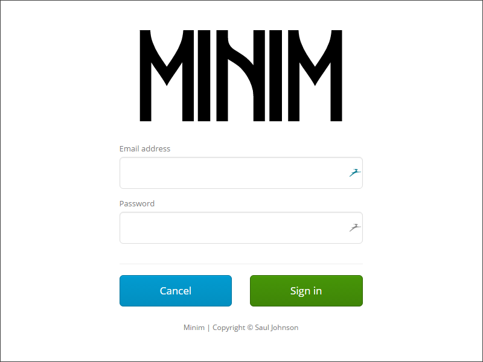

# Minim
Minimal single-user auth in PHP.



Every so often, you build a website that needs:
  * to run without a database
  * to have an administrator backend
  * to be accessible by one user only

Minim is designed for this purpose; to be a secure, single-user authentication system that doesn't do anything silly like leak the users password (or store it in plain text) or operate over insecure (non-HTTPS) connections unless you want it to.

## Prerequisites
You'll need to have a web server installed and configured with PHP for this to work. I really recommend [XAMPP](https://www.apachefriends.org/), especially for Windows users. Once you've done that you can proceed.

You'll also need [Node.js](https://nodejs.org/en/) and [npm](https://www.npmjs.com/) installed and working.

## Building
Clone the project down and open the folder in your favourite editor. It's a JetBrains PhpStorm project but you can use whichever paid/free software takes your fancy.

Before anything else, note that this project uses the [Composer](https://getcomposer.org/) package manager. Install composer (see their website) and run:

```
composer install
```

Or alternatively, if you're using the PHAR (make sure the `php.exe` executable is in your PATH):

```
php composer.phar install
```

Then, install the npm packages necessary to build and run the website. Run the following in your terminal in the project root directory:

```
npm install
```

This will install [Bower](https://bower.io/) which will allow you to install the assets the website requires (Bootstrap, jQuery etc.) using the command:

```
bower install
```

Gulp will also have been installed. This will compile the [Less](http://lesscss.org/) into CSS ready for production. Do this using the command:

```
gulp
```

This command will need running again every time you make a change to a Less file. If you're working on them, run `gulp watch` in a terminal to watch for file changes and compile accordingly.

## Installation
Minim comes with a set of default credentials.

```
Email: me@example.com
Password: demo
```

These *must* be changed before you go into production, so sort these out first:

* Copy `config.yml.dist` and rename the copy to `config.yml`.
* Open up `config.yml` in your favorite text editor.
* Change the `admin_email` field to your email address
* Change the `admin_password_hash` field to the SHA-256 hash of a password of your choice. Never use online services to create your hashes, but hashes created using [this service](http://www.xorbin.com/tools/sha256-hash-calculator) will work. Don't forget to append your `salt`.
* Change the `secret_key` field to a randomly-generated string at least 12 characters long.
* Change the `salt` field to a randomly-generated string at least 12 characters long.
* The default value of 32 for the `token_length` field should be okay for most applications.
* The default value for the `token_ttl` field of 1200 seconds (20 minutes) should be okay for most applications.
* Change the `session_file_name` field to the absolute path of a writable file on your server that Minim can read and write, but that your server _will not serve_.
* Change `cookie_ssl_only` field to `true` if you're operating over HTTPS. If you're not, take a long hard look at your application and ask yourself why you're considering asking for user credentials over an insecure connection when amazing, free tools like [Let's Encrypt](https://letsencrypt.org/) exist.
* Leave `cookie_http_only` as `true` to make the authentication cookie readable only over HTTP and not by client-side script.

## Limitations
I'm not a security researcher, don't rely on Minim to be secure out of the box and always perform your own penetration testing.
